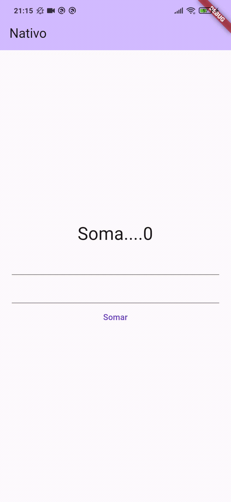

# flutter_nativo

Sétimo projeto finalizado no curso "Aprenda Flutter e Desenvolva Apps Para Android e IOS 2022".

Neste módulo do curso, foi ensinado brevemente como fazer uma comunicação do Flutter com o código nativo em Kotlin e Swift. O usuário faz uma soma simples, onde a requisição é enviado para o MainActivity.kt (se o dispositivo for Android) ou para o AppDelegate.swift (se o dispositivo for iOS).

Versão do Flutter: 3.10.2

